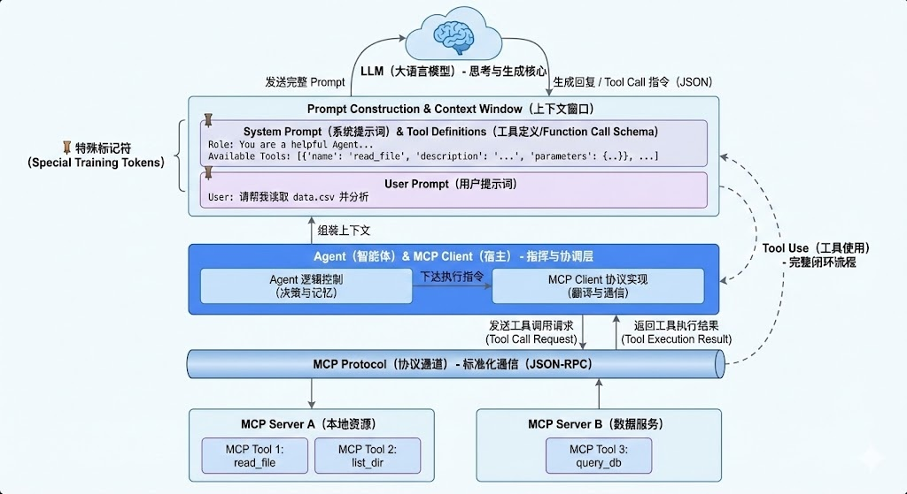
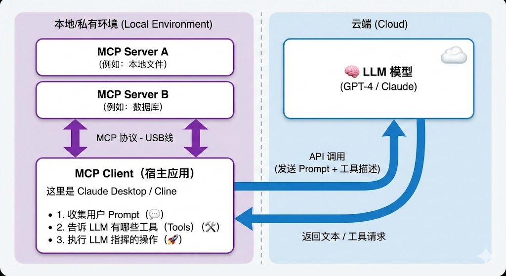

AI 的发展日新月异。在 2025 年之前，出圈的名词可能只有“深度学习”、“神经网络”、“大语言模型”等寥寥几个。对于大众而言，这些名词更像是黑盒技术，不需要深入理解也能享受其带来的便利。

但随着 2025 年计算机辅助编程（AI Coding）的兴起，以及 AI 在多维度的快速落地，技术圈的风向发生了变化。现在，大家关注的焦点不再仅仅是“模型有多强”，而是 **“如何利用 AI 构建能解决复杂问题的产品”**。我们开始意识到，任何一个独立个体，都有可能在 AI 的帮助下完成以前需要通过团队协作才能完成的复杂开发工作。

在这种背景下，**AI Agent（人工智能智能体）** 成为了当下的绝对主角。它不仅是 AI 能力的突破口，更是下一代应用架构的核心。

趁着这段时间对 Agent 相关技术栈的系统学习，我整理了这篇笔记，主要聊聊 **Agent**、**MCP**、**Tool Use** 以及构建高级智能体的关键拼图。

## 什么是 Agent？

我理解的 **Agent**，本质上是一种**以大语言模型（LLM）为核心大脑，具备感知、规划和行动能力的系统**。Agent 不是 LLM 本身，而是 LLM 的“宿主”或“运行环境”。

从能力进化的角度，我们可以将 Agent 分为三个阶段：

### 1. 工作流 (Workflow)
这是 Agent 的雏形。它本质上是**自动化脚本**。系统按照预设的固定流程（如 `If-Then-Else`）执行任务。虽然用到了 LLM 处理文本，但路径是死的，缺乏灵活性。

### 2. 具备工具调用能力的 Copilot
在这个阶段，系统能理解用户的意图，并**自主决定**调用什么工具来解决问题（例如：“查一下天气” -> 调用天气 API）。但它的行为依然是**被动**的，通常采用“一问一答”的交互模式，缺乏对复杂任务的拆解能力。

### 3. 真正的智能体 (Autonomous Agent)
这是 Agent 的完全体。它具备**自主规划**与**闭环**能力。
* **自主规划**：面对一个模糊的目标（如“帮我写个贪吃蛇游戏并部署”），它能将其拆解为一些列子任务。
* **自我反思与修正**：它能感知环境反馈。如果代码运行报错，它会根据错误信息调整计划，重新尝试，直到任务完成。它拥有了 `感知 -> 思考 -> 行动 -> 观察 -> 再思考` 的完整闭环。

## Agent 是如何工作的？

Agent 可以被看作是一个**中间件（Middleware）**或**编排系统**。
* **左手连接 LLM**：负责提供决策大脑。
* **右手连接 Tools**：负责提供手脚（执行能力）和感官（信息获取）。

Agent 的核心工作就是把任务、LLM 和工具串联起来。

为了搞清楚它到底怎么跑起来的，我找了一张非常清晰的架构图：

这张图里面有几个非常有意思的细节，刚好解释了 LLM 是怎么“看见”工具的：

### 1. 提示词的组装 (Prompt Construction)
Agent 会把三个东西打包塞进 LLM 的**上下文窗口 (Context Window)** 里：
* **System Prompt (系统提示词)**：这里不仅定义了“你是谁”（比如：你是一个资深程序员），最关键的是，所有的 **工具定义 (Tool Definitions)** 也是写在这里的！Agent 会把能用的工具（比如 `read_file`, `query_db`）描述成一串文本塞给 LLM。这个工具定义即为Tool Call（或叫Function Call）。
* **User Prompt (用户提示词)**：就是我问的那句“帮我分析这个数据”。
* **特殊标记符**：图里提到的 Special Training Tokens，这是给模型看的“暗号”，告诉它哪里是指令，哪里是内容。

### 2. 交互的闭环
* **MCP Client** 负责把工具转成文字喂给 LLM。（转换的逻辑即为MCP Protocol翻译成Tool Call）
* **LLM** 思考后，如果决定用工具，就会吐出一段 JSON（Tool Call 指令）。
* **MCP Protocol** 负责去实际执行这个指令，并把结果拿回来。

这整个过程，就是一个不断“组装 Prompt -> 思考 -> 执行 -> 再组装结果 -> 再思考”的循环。

## 什么是 MCP (Model Context Protocol)？

如果说 Agent 是电脑，工具是外设，那么 **MCP 就是 AI 时代的 USB 协议**。

MCP（Model Context Protocol）定义了一种标准，用于把数据（Resources）、工具（Tools）和提示词模板（Prompts）包装成 LLM 可以理解的通用接口。

* **MCP Server**：工具的提供方（例如一个读取本地文件的服务）。
* **MCP Client**：Agent 的宿主程序（例如 Claude Desktop 或 Cursor），它负责连接 Server 并把能力暴露给 LLM。

**核心价值**：MCP 实现了**“一次开发，到处运行”**。开发者写好一个 MCP Server，就可以被任何支持 MCP 的 Agent 调用，极大地解决了生态碎片化的问题。

*(图注：MCP 协议连接架构图)*

## 什么是 Tool Use？

**Tool Use**（工具使用），在早期通常被称为 **Function Calling**（函数调用）。它是 LLM 与外部世界交互的 **“通信协议”**。

虽然 MCP 解决了“怎么连接工具”的问题，但 Tool Use 解决的是“**LLM 如何告诉程序它想用工具**”的问题。

* **Function Call**：更侧重于底层技术实现。即 LLM 输出一个特定的 JSON 结构（包含函数名和参数），程序捕获这个 JSON 并执行代码。
* **Tool Use**：是更广义的能力描述。除了调用用户定义的函数，还包括模型内置的能力，如 **Code Interpreter**（代码解释器）、**Web Search**（联网搜索）等。

遗憾的是，目前各家大模型厂商（OpenAI, Anthropic, Google）在 Tool Use 的具体 JSON 格式定义上仍有差异，尚未完全统一。

*(图注：Agent 结合 Tool Use 的完整工作流)*

---

## 进阶：构建高级 Agent 的关键拼图

当 Agent 能够调用工具后，它只是有了“手”。要让它解决现实世界中的复杂问题，我们还需要赋予它“元认知”、“团队协作能力”、“记忆”以及“安全机制”。

### 1. 规划模式 (Planning Patterns)：Agent 的“元认知”

常见的 Agent 思考模式有以下三种：

* **ReAct (Reason + Act)**：最经典的单步推理模式。
    * **流程**：思考（Reason） -> 行动/调用工具（Act） -> 观察结果（Observe） -> 再思考 -> 再行动。
    * **价值**：它让 Agent 不会一股脑把所有工具都瞎调一遍，而是每一步都看一眼结果再决定下一步，显著减少幻觉。
* **CoT (Chain of Thought)**：思维链。
    * 在调用工具前，强制模型先写出“第一步、第二步、第三步”。对于数学或逻辑类任务，这能显著提高成功率。
* **TOT (Tree of Thoughts)**：思维树。
    * 让 Agent 同时构思三种方案，自己评估哪种最好，然后再执行。这是一种更高级的探索性思考。

### 2. 多智能体协作 (Multi-Agent Systems)：团队作战

如果让一个 Agent 既写代码、又写文案、又做测试，它会因为上下文（Context）太乱而崩溃。复杂的任务需要分工，这就是 **Orchestrator（指挥官）模式**：

* **Controller Agent (项目经理)**：负责拆解任务，不干具体活，只分派。
* **Coder Agent (程序员)**：只挂载了代码相关的 MCP 工具。
* **Reviewer Agent (测试员)**：只挂载了测试相关的 MCP 工具。

**流程**：用户 -> 经理拆解 -> 分派给程序员 -> 程序员写完 -> 提交给测试员 -> 测试员报错 -> 打回给程序员。

> **核心观点**：MCP 解决了“工具”的解耦，Multi-Agent 解决了 **“职责”的解耦**。

### 3. 记忆机制 (Memory)：拒绝“失忆”

MCP 可以提供数据访问，但在 Agent 架构上，我们需要区分两种记忆：

* **短期记忆 (Context Window)**：就是当前的聊天记录。它是有限的（受限于模型窗口）、昂贵的（Token 费钱）。
* **长期记忆 (Vector Database / RAG)**：这是 Agent 的“外挂硬盘”。当 Agent 处理长期任务时，它需要把重要的信息（比如用户的喜好、上周的项目进度）存进向量数据库（如 Pinecone, Milvus）。

**关键点**：高级 Agent 需要学会**主动**去读写这个硬盘，而不是被动等待用户输入。

> 没有长期记忆的 Agent 就像电影**《初恋50次》**里的主角，每天醒来都是崭新的一天，干不了大事。

### 4. 人在回路 (Human-in-the-loop)：安全气囊

这是 Agent 从 Demo 走向 Production（生产环境）最关键的一步。当 Agent 决定调用 `delete_database` 这种高危工具，或者是给老板发一封措辞激烈的邮件时，你敢让它全自动执行吗？

**HITL 机制**：在 Agent 产出 `tool_calls` JSON 之后，真正执行 MCP 工具之前，插入一个 **“人工确认”**环节。
* **审批**：关键操作必须人类点击“Approve”。
* **修正**：人类发现 Agent 参数填错了（比如把“周二”填成了“周三”），人类手动修改 JSON，再放行。

**一句话总结**：AI 负责副驾驶，但在关键时刻，**人类必须手握方向盘**。

---

## 常见的 Agent 开发框架

如果你想动手开发一个 Agent，以下几个框架是目前的主流选择：

1.  **Dify**：开源的 LLM 应用开发平台。主打**可视化编排**，适合快速构建和验证 Agent Idea，对非程序员非常友好。
2.  **LangGraph**：由 LangChain 团队推出。它引入了“图”的概念来控制 Agent 的循环（Loop）和状态（State），非常适合构建复杂的、有状态的**多智能体（Multi-Agent）系统**。
3.  **PydanticAI**：由 Python 界著名的 Pydantic 团队开发。它主打**类型安全（Type Safe）**和**原生 Python 体验**。它能极其优雅地解决 Function Call 中 JSON 结构定义与校验的痛点，是追求代码质量的开发者的首选。

---

> **总结**
>
> * **Agent** 是大脑（LLM）+ 手脚（Tools）+ 记忆（Memory）的自主系统。
> * **MCP** 是连接工具的“USB 标准协议”。
> * **Tool Use** 是模型驱动工具执行的“动作描述”。
> * **进阶架构**（规划、MAS、记忆、HITL）是构建复杂生产级 Agent 的必经之路。

希望这篇笔记能帮你理清 AI Agent 的核心脉络。未来的软件开发，或许就是编写一个个 MCP Server，然后让 Agent 自己去组装它们。